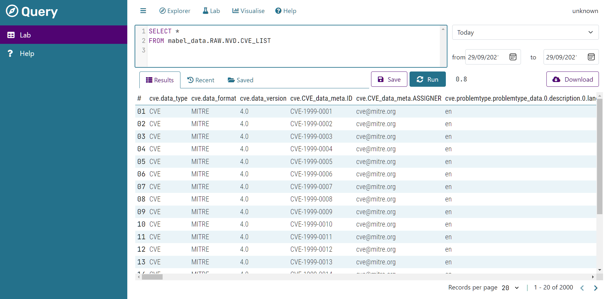

### Query

_SQL IDE for mabel datasets_

---

**Query** is a SQL IDE for [mabel](https://github.com/mabel-dev/mabel) datasets.

This project is _alpha_, some functionality only works under the right conditions.

## NOTE: Query requires mabel v0.5 or later, which is being developed in parallel